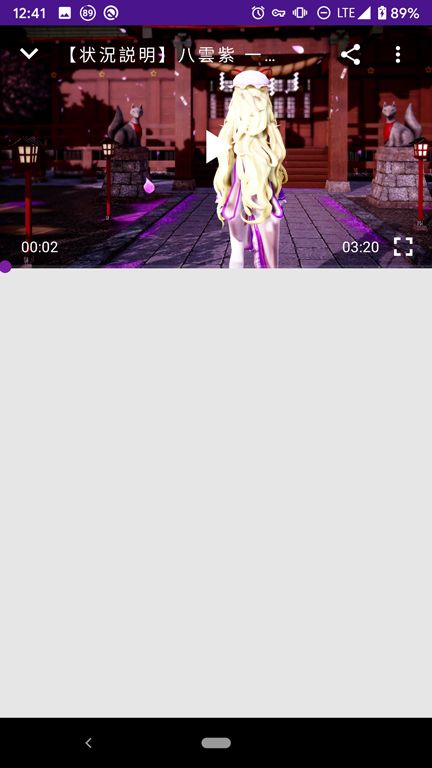

# Iwara-android-client


## 说明  
Iwara非官方安卓客户端，完全使用Material Design设计，Youtube like播放器，目前仅完成视频列表和播放器以及一些简单的功能。

目前整体重构中，因为设计苦手所以进度缓慢，如果您愿意指点一二或有兴趣参与项目请务必联系我

## 下载

获取编译好的APK文件，请移步[Release](https://github.com/zhkrb/Iwara-android-client/releases)  

## 截图
Appbar目前仅为测试用，并非最终设计(-_,-……)





## 进度

查看更新日志请移步[Change_log](Change_log.md)

### 已完成
- [x] 单页框架
- [x] 视频列表
- [x] 视频列表手势缩放
- [x] YouTube like播放器
- [x] 一些简单的播放器设置
- [x] 版本管理

### TODO
- [ ] 重新修改Appbar
- [ ] 播放器底部视频详情页
- [ ] 用户详情页
- [ ] 帐号相关功能
- [ ] 侧边栏内容
- [ ] 设置
- [ ] 搜索以及自定义筛选
- [ ] 下载管理
- [ ] 隐私设置
- [ ] ...

## 依赖

- [jsoup](https://github.com/jhy/jsoup)
- [retrofit](https://github.com/square/retrofit)
- [GSYVideoPlayer](https://github.com/CarGuo/GSYVideoPlayer)
- [ijkplayer](https://github.com/bilibili/ijkplayer)
- [RxJava](https://github.com/ReactiveX/RxJava)
- [fastjson](https://github.com/alibaba/fastjson)
- [glide](https://github.com/bumptech/glide)


以及参考了许多[EhViewer](https://github.com/seven332/EhViewer)在基础框架上的实现

## Issues
如果您发现任何问题，请尝试再次复现以及排除网络相关原因后反馈，这样可以使我尽快修改它。  
当然如果您有关于功能和设计相关以及使用体验上的反馈，也欢迎您提交issue。

## License


```
  Copyright zhkrb
 
  Licensed under the Apache License, Version 2.0 (the "License");
  you may not use this file except in compliance with the License.
  You may obtain a copy of the License at
 
      http://www.apache.org/licenses/LICENSE-2.0
 
  Unless required by applicable law or agreed to in writing, software
  distributed under the License is distributed on an "AS IS" BASIS,
  WITHOUT WARRANTIES OR CONDITIONS OF ANY KIND, either express or implied.
  See the License for the specific language governing permissions and limitations under the License.
  
```
